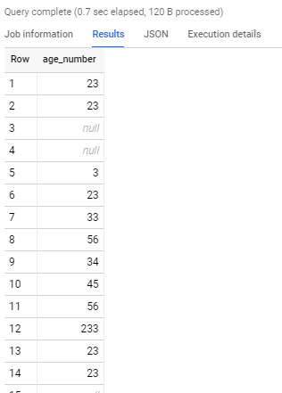

```sql


select 

cast(age as int64) age_number

from `data-science-course-226116.sql_lessons.employees` 

```



```sql
select 
cast ('yossi is good' as int64)   -- this won't work since I can't make my name into a number 


select cast('    456    ' as int64) test -- This works, even thouggh the sapces are considered strings, the numbers are ingnored ---- similar to the way we use TRIM on strings 


```


cast ('64' as string) 
cast('happy' as string)


```sql

select 
safe_cast ('yossi is good' as int64) -- this will show me null instead of an error


```


